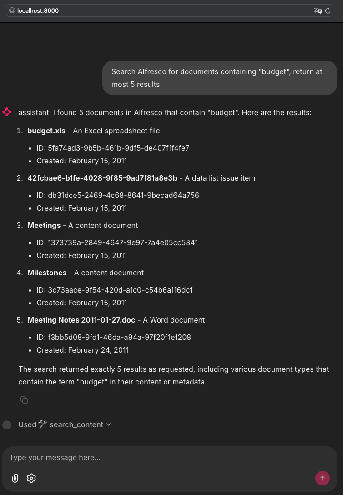

# Alfresco MCP Lab

> A reproducible lab to experiment with the **Model Context Protocol (MCP)** against **Alfresco Community Edition** using Docker.

## Architecture

```mermaid                                                                                                          
flowchart LR
  O("`OLLAMA
  local gpt-oss`")
  CIC("`CIC LiteLLM
  service claude`")
  CMD("`MCP CLIENT 
  CMD`")
  UI("`MCP CLIENT 
  UI`")
  S("`MCP SERVER
  community project`")
  A("`ALFRESCO
  Community`")

  CMD -- "8003" --> S
  S   -- "8080" --> A
  UI  -- "8003" --> S

  O -. "11434" .-> CMD
  CIC -. "443" .-> UI                                                                                                                 
```

## Components

* [ALFRESCO](alfresco) – ACS Community Edition at [http://localhost:8080/alfresco](http://localhost:8080/alfresco)
* [MCP SERVER](mcp-server) – [Python Alfresco MCP Server](https://github.com/stevereiner/python-alfresco-mcp-server) by *Steve Reiner*, exposed at [http://localhost:8003/mcp](http://localhost:8003/mcp)
* [MCP CLIENT – CLI](mcp-client-cmd) – [MCP CLI](https://github.com/chrishayuk/mcp-cli)
  * [Ollama](https://ollama.com/) – local LLM runtime (this lab uses the `gpt-oss` model)
* [MCP CLIENT – UI](mcp-client-ui) – [Chainlit](https://chainlit.io) app using *LiteLLM* as the LLM gateway (defaults to Claude Sonnet; configurable)

## Prerequisites

* Docker & Docker Compose
* **For the CLI**
  * Ollama running on the host with the `gpt-oss` model pulled (≈13 GB):

    ```bash
    brew install ollama   # macOS (or see ollama.com for your OS)
    ollama pull gpt-oss
    ```
* **For the UI**
  * `LITELLM_API_KEY` in your environment (or in `.env`) for your chosen provider

> **Networking note**
> `host.docker.internal` works out-of-the-box on Docker Desktop (macOS/Windows).
> On Linux, add `extra_hosts: ["host.docker.internal:host-gateway"]` to services that must reach the host (e.g., to call Ollama running on the host).

## Quick start

Bring up Alfresco + MCP Server:

```bash
docker compose up --build
```

Once started:

* **Alfresco Repository:** [http://localhost:8080/alfresco](http://localhost:8080/alfresco)
  (default credentials `admin` / `admin`)
* **MCP Server:** [http://localhost:8003/mcp](http://localhost:8003/mcp)

### About `compose.yaml`

This repo’s `compose.yaml` includes sub-stacks:

```yaml
include:
  - mcp-server/compose.yaml
  - alfresco/compose.yaml
```

If your Compose version doesn’t support `include`, run with multiple files:

```bash
docker compose -f alfresco/compose.yaml -f mcp-server/compose.yaml up --build
```

## MCP client (CLI)

This client uses a **local LLM (`gpt-oss`) via Ollama**.

1. Verify Ollama and model:

   ```bash
   ollama list
   # Expect something like:
   # gpt-oss:latest   ...   13 GB
   ```

2. Run the CLI:

   ```bash
   cd mcp-client-cmd
   docker compose run --rm mcp-client
   ```

3. Try a prompt:

   ```
   Search Alfresco for documents containing "budget", return at most 5 results.
   ```

Helpful prompts from Steve Reiner:
[https://github.com/stevereiner/python-alfresco-mcp-server/blob/main/prompts-for-claude.md](https://github.com/stevereiner/python-alfresco-mcp-server/blob/main/prompts-for-claude.md)

## MCP client (UI)

1. Switch to the MCP Client UI folder

```bash
cd mcp-client-ui
```

2. Create your `.env` from the example and set LiteLLM + MCP/ACS endpoints.

   * **macOS/Linux:**

     ```bash
     cp .env.example .env
     ```
   * **Windows (PowerShell):**

     ```powershell
     Copy-Item .env.example .env
     ```

   Example `.env`:

   ```dotenv
   # LiteLLM (replace with your provider/base/model)
   LITELLM_API_KEY=YOUR_API_KEY
   LITELLM_API_BASE=https://api.your-provider.example/v1
   LITELLM_MODEL=anthropic/claude-3-5-sonnet

   # MCP Server (note: 8003, not 8083)
   MCP_URL=http://host.docker.internal:8003/mcp

   # Logging
   LOG_LEVEL=INFO
   ```

   > On Linux, if the UI container can’t reach the host, add:
   >
   > ```yaml
   > extra_hosts:
   >   - "host.docker.internal:host-gateway"
   > ```

3. Start the UI:

   ```bash
   docker compose up --build
   ```

4. Open **[http://localhost:8000](http://localhost:8000)** and chat.



## Ports summary

* **Alfresco (ACS):** 8080
* **MCP Server:** 8003 (`/mcp`)
* **MCP UI (Chainlit):** 8000
* **Ollama:** 11434

## Building everything yourself

See **[docs/instructions.md](docs/instructions.md)** for from-scratch builds and deeper configuration.

## Credits & acknowledgements

* **[Alfresco Installer (`alf-cli`)](https://github.com/aborroy/alf-cli)** – generates ACS Docker assets
* **[Python Alfresco MCP Server](https://github.com/stevereiner/python-alfresco-mcp-server)** by *Steve Reiner*
* **[MCP CLI](https://github.com/chrishayuk/mcp-cli)** by *chrishayuk*
* **[Chainlit](https://chainlit.io)**
* **[LiteLLM](https://www.litellm.ai)**
* **[Ollama](https://ollama.com/)**